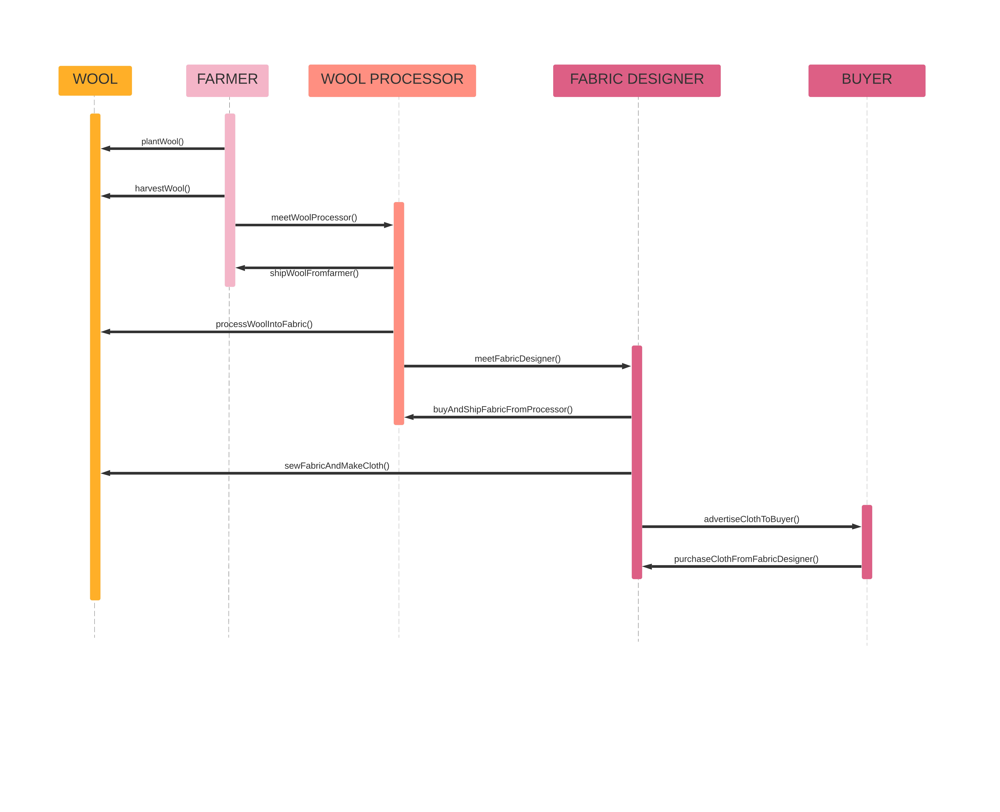

# Wool Supply Chain

This repository contains an Ethereum DApp that demonstrates the Supply Chain flow for `wool` from when it is planted by the farmer till when it's worn as cloth.

There are 4 actors involved in this supply chain:

1. Farmer

2. Wool Processor

3. Fabric Designer

4. Buyer / Consumer

The UML diagrams below illustrates the relationships and actions performed by each actor and how it affects the state of the wool.

## Activity Diagram


## Sequence Diagram


## State Diagram


## Data model


## Steps to run the application

0. Make sure you have Truffle installed (https://www.trufflesuite.com/docs/truffle/getting-started/installation). Also have Metamask chrome extension installed (https://metamask.io/)

1. Clone this repository

2. run `npm install`

3. `cd` into app and again `npm install`

4. Go back to the project root and run `truffle develop`

5. From the develop console, run `compile`

6. Run `test` to ensure all the tests are passing

7. Run `migrate`

8. From a separate tab on your terminal and in the project root, run `npm run client`

9. Go to `localhost:8081` on your browser to interact with the app.

10. Enjoy!


### This DApp has been deployed onto the Rinkeby test network. Find details below

Transaction Hash: 0x092b34f17f0e880f6c25f1babac985f10c58cd1b6fe6c6cf3ca9c72ee4625fbc

Contract Address: 0x426D6f37C27D074de75838E7D162C1dE02B87743

#### Here are the development tools used

Remix IDE

Truffle v5.1.34 (core: 5.1.34)

Solidity v0.5.16 (solc-js)

Node v10.16.3

Web3.js v1.2.1

Dependencies:

```json
  {
    "@truffle/hdwallet-provider": "^1.0.43",
    "dotenv": "^8.2.0"
  }
```
